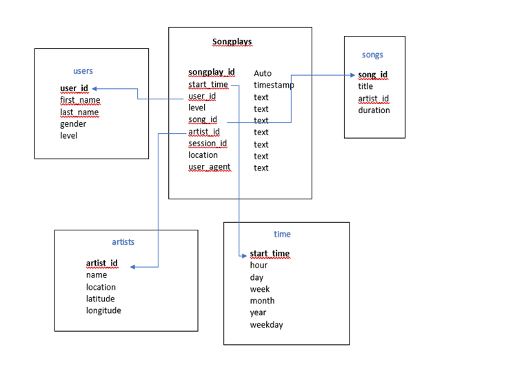

A company called Sparkify has data in the form of JSON logs with information about user activity on their app and JSON metadata of the songs in their app. The goal is to understand what songs users are listening to. 

An ETL pipeline was created that extracts data from the JSON files in two local directories into tables in Postgres using Python and SQL. 

## Database Schema 

A star schema was used to optimize for queries on song play analysis. This includes the following tables.

 
### Dimension Tables

The entities like users , songs, artists and time are stored in the following tables

* users - Used to store users in the app ( primary key is user_id)
* songs - Used to store songs in music database (primary key is song_id)
* artists - Used to store artists in music database (primary key is artist_id)
* time - Used to store timestamps of records in songplays broken down into specific units (primary key is start_time)
    
### Fact Table 

The records in the log data (events) associated with song plays is stored in a table called songplays. The primary key is songplay_id and this is an auto generated serial number. The keys like user_id,  song_id,artist_id,start_time references the primary keys in the dimension tables.

The dimension tables supports filtering and grouping and the fact table supports summarization. This makes it easier to do song play analysis. 
  
 

## ETL pipeline

Udacity provided a subset of the real data from the <a href=http://millionsongdataset.com/> Million Song Dataset</a>  for this project.

ETL was performed on the first dataset song_data, to get data for the ‘songs’ and ‘artists’ dimensional tables.
The second dataset, log_data, was used to create the ‘time’ and ‘users’ dimensional tables, and the ‘songplays’ fact table. In order to get the timestamp, hour, day, week of year, month, year, and weekday for the time table, Python panda was used.
In order to get the data for the ‘songplays’ fact table, the song ID and artist ID was queried using the songs and artists tables to find matches based on song title, artist name, and song duration time in the log table. 

 
## Instructions for the ETL pipeline
 
To run this project, run the following commands -:
python3 create_tables.py - This will create the tables in postgre

python3 etl.py - This will load the tables.
 
## Queries for song play analysis

Here are some queries that can be used for song play analysis.

1) List the title, artist , the year and the duration of the songs that are the most popular. 

select 
  count(*) as Song_play_count, 
  songs.title as Song_name, 
  artists.name as Artist,
  songs.year,
  songs.duration 
from songplays songplays
inner join songs on songplays.song_id = songs.song_id 
inner join artists artists on songplays.artist_id = artists.artist_id 
group by  songs.title, artists.name, songs.year, songs.duration 
order by song_play_count desc;

2) List the 10 most popular artists 

select 
  count(*) as Song_play_count,  
  artists.name as Artist
from songplays songplays 
inner join artists artists on songplays.artist_id = artists.artist_id 
group by   artists.name  
order by song_play_count desc LIMIT 10;
