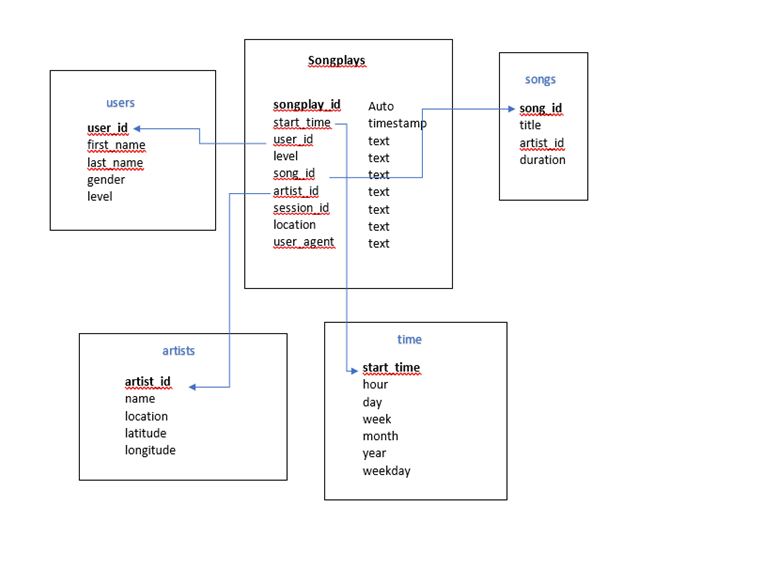

A company called Sparkify has data in the form of JSON logs with information about user activity on their app and JSON metadata of the songs in their app. The goal is to understand what songs users are listening to. 

An ETL pipeline was created that extracts data from the JSON files in two local directories into tables in Postgres using Python and SQL. A star schema was used to optimize for queries on song play analysis. This includes the following tables.

Fact Table 
The records in the log data (events) associated with song plays is stored in a table called songplays. 
 
Dimension Tables
The entities like users , songs, artists and time are stored in the following tables
    users - users in the app 
    songs - songs in music database 
    artists - artists in music database 
    time - timestamps of records in songplays broken down into specific units 
   
The dimension tables supports filtering and grouping and the fact table supports summarization. This makes it easier to do song play analysis. 
  
 
 
To run this project, run the following commands in the command prompt.
python3 create_tables.py
python3 etl.py
 
Here are some queries that can be used for song play analysis.

1) List the title, artist , the year and the duration of the songs that are the most popular. 

select 
  count(*) as Song_play_count, 
  songs.title as Song_name, 
  artists.name as Artist,
  songs.year,
  songs.duration 
from songplays songplays
inner join songs on songplays.song_id = songs.song_id 
inner join artists artists on songplays.artist_id = artists.artist_id 
group by  songs.title, artists.name, songs.year, songs.duration 
order by song_play_count desc;

2) List the 10 most popular artists 

select 
  count(*) as Song_play_count,  
  artists.name as Artist
from songplays songplays 
inner join artists artists on songplays.artist_id = artists.artist_id 
group by   artists.name  
order by song_play_count desc LIMIT 10;
